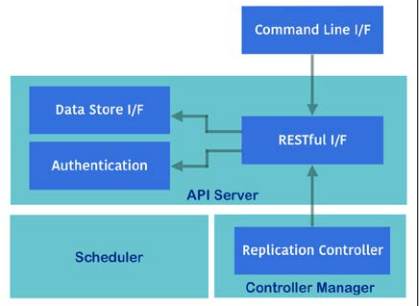

# Kubernetes overview

## Introduction

Kubernetes is constructed using several components:
- *Kubernetes master*
    + Authorization and authetication
    + RESTful API entry point
    + Container deployment scheduler to the Kubernetes nodes
    + Scaling and replicating the controller
    + Read and store the configuration
    + Command line interface



    + kube-apiserver: the hub between Kubernetes components such as kubectl,
      scheduler, replication controller (replica sets), etd datastore,
      kubelet & kube-proxy.
    + kube-scheduler: choose which container runs by which nodes
    + kube-controller-manager: peforms cluster operations.

- *Kubernetes nodes*
    + It is controlled by Kubernetes master to run the container application
      using Docker or rkt.
    + kubelet: the main process on Kubernetes node that communicates with
      master to handle Periodically access the API controller, perform
      container operations & run the HTTP Server to provide simple APIs.
    + kube-proxy: handles network proxy & load balancer for each container. It
      performs to change the Linux iptables rules to control TCP & UDP packets
      accross the containers.

- *etcd*:
    + distributed key-value datastore.
    + Main datastore.
    + Explore the Kubernetes configuration and status in etcd:

    ```
    # curl -L "http://10.0.0.1:2379/v2/keys/registry"
    ```

- *overlay network (flannel)*:
    + Network communicate - multihost.
    + Flannel also uses etcd to configure the settings and store the status.

    ```
    # curl -L "http://10.0.0.1:2379/v2/keys/coreos.com/network/config"
    ```

    + More details can refer [1]


- **Kubernetes master** connect to **etd** via HTTP/HTTPS to store data and connect to
  **flannel** to access the container application.
- **Kubernetes nodes** connect to the **Kubernetes master** via HTTP/HTTPS to get a
  command and report the status.
- **Kubernetes nodes** use an overlay network (**flannel**) to make a connection of
  their container applications.

## Concepts

### 1. Pods

- The pod is a group of 1 or more containers and the smallest deployable unit
  in Kubernetes. Pods are always co-located and co-scheduled and run in a
  shared context. Each pod is isolated by the following Linux namespaces:
  + PID namespace
  + Network namespace
  + Interprocess Commnunication (IPC) namespace
  + Unix Time Sharing (UTS) namespace

#### 2. Replication controller

- A term for API objects in Kubernetes that refers to pod replicas.
- To be able to control a set of pod's behaviors.
- Ensures that the pods, in a user-specified number, are running all the time.
  If some pods in the replication controller crash and terminate, the system
  will recreate pods with the original configurations on healthy nodes
  automactically, and keep a certain amount of processes continously running.
- This concept is outdated. Kubernetes official documentation recommends: A
  Deployment that configures a ReplicaSet is now the recommended way to set up
  replication.

### 3. Replica Sets

- ReplicaSet is the next-generation Replication Controller. The only between
  them right now is the selector support. ReplicaSet supports the new
  set-based selector requirements whereas a RC only supports equality-based
  selector requirements (Official Documenation)

### 4. Deployment

- Deployments are intented to replace Replication Controllers. They provide
  the same replication functions (through Replica Sets) and also the ability
  to rollout changes and roll them back if necessary.
- `rolling-update` command works with Replication Controllers, but won't work
  with Replica Set. This is because RS are meant to be used as the backend for
  Deployments.

### 5. Service

- It is an abstraction which defines a logical set of Pods and a policy by
  which to access them - sometimes called a micro-service. The set of Pods
  targeted by a Service is (usually) determined by Label Selector.

    + ClusterIP: Exposes the service on a cluster-internal IP.
    + NodePort: Exposes the service on each Node's IP at a static port.
    + LoadBalancer: Exposes the service externally using a cloud provider's
      load balancer.
    + ExternalName: Maps the service to the contents of the externalName.


### 6. Volume

- Volume lives with a pod across container restarts.
- It supports the following different types of network disks:
    + emptyDir
    + hostPath
    + nfs
    + iscsi
    + flocker
    + glusterfs
    + rbd
    + gitRepo
    + awsElasticBlockStore
    + gcePersistentDisk
    + secret
    + downwardAPI

### 7. Secrets

### 8. Namespaces

- The name of a resource is a unique identifier with a namespace in the
  Kubernetes cluster. Using a Kubernetes namepsace could isolate namespaces
  for different environments in the same cluster.
- Pods, services, replication controllers (replica sets) are contained in a
  certain namespace. Some resources, such as nodes and PVs, do not belong to
  any namespace.

### 9. Label & Selector

- Labels are a set of key/value pairs, which are attached to object metadata.

## Installation

## Refs

[1] [Flannel for Docker Overlay Network](http://chunqi.li/2015/10/10/Flannel-for-Docker-Overlay-Network/)
