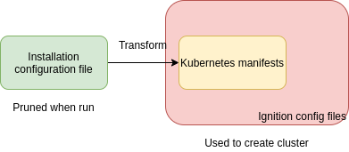
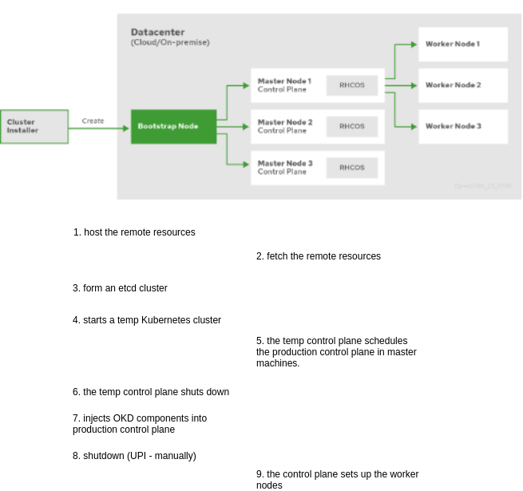

# Installation

Source:

- https://docs.okd.io/latest/architecture/architecture-installation.html
- https://www.openshift-anwender.de/wp-content/uploads/2020/02/OpenShift_Installation_Deep_Dive_Robert_Bohne.pdf

- [Installation](#installation)
  - [1. Overview](#1-overview)
  - [2. Deep Dive](#2-deep-dive)
    - [2.1. Fedora CoreOS](#21-fedora-coreos)
    - [2.2. CRI-O](#22-cri-o)
    - [2.3. Skopeo](#23-skopeo)
    - [2.4. Podman](#24-podman)
    - [2.5. Buildah](#25-buildah)
    - [2.6. Ignition](#26-ignition)
  - [3. Installation Experiences](#3-installation-experiences)
    - [3.1. Full stack automated (IPI)](#31-full-stack-automated-ipi)
    - [3.2. Pre-existing Infrastructure (UPI)](#32-pre-existing-infrastructure-upi)
  - [4. Installation process](#4-installation-process)
  - [5. Install on OpenStack](#5-install-on-openstack)
    - [5.1. OKD on RHOSP support matrix](#51-okd-on-rhosp-support-matrix)
    - [5.1. UPI - OpenStack](#51-upi---openstack)
    - [5.2. UPI - OpenStack + Kuryr](#52-upi---openstack--kuryr)

## 1. Overview

- There are 2 basic types of OKD clusters:

  - installer-provisioned infrastructure clusters (IPI).
  - user-provisioned infrastructure clusters (UPI).

- Subset of the installation targets and dependencies:

## 2. Deep Dive

### 2.1. Fedora CoreOS

- OpenShift -> RHEL CoreOS.
- Each cluster machine uses [Fedora CoreOS (FCOS)](https://getfedora.org/en/coreos?stream=stable).
- FCOS is the immutable container host version of Fedora and features a Fedora kernl with SELinux enabled by default.
- **There are no RPM's anymore**, all is installed via Operators and Container images.
  - Atomic OS Tree.
  - Machine Config Operator:
    - CRI-O config
    - Kubelet config
    - Authorized registries
    - SSH config

### 2.2. CRI-O

https://github.com/cri-o/cri-o

- A lightweight, OCI-compliant container runtime.
  - Minimal and secure architecture.
  - Optimized for Kubernetes.
  - Runs any OCI-compliant image (including Docker)
  - Implements Kubelet Container runtime interface (CRI)

### 2.3. Skopeo

https://github.com/containers/skopeo

- Build for interfacing with Docker registry
- CLI for images and image registries
- Allow remote inspectation of image meta-data - no downloading
- Can copy (non-root) from one storage to another

### 2.4. Podman

https://github.com/containers/podman

- A tool for managing OCI containers and pods
- Support for a Docker-compatible CLI interface.
- Shares state with CRI-O and with Buildah
- No daemon
- Runtime - `runc`
- Full management of images, container lifecycle.
- Support for pods, groups of containers that share resources and are managed together.
- Resource isolation of containers and pods.

### 2.5. Buildah

https://github.com/containers/buildah

- Build OCI compliant images
- No daemon - no "docker socket"
- Can use the host's user's secrets
- **Single layer, from scratch image** are made easy and it ensures limited manifest

### 2.6. Ignition

https://github.com/coreos/ignition

- First boot installer and configuration tool
- Machine generated; machine validate
- Ignition applies a declarative node configuration early in the boot process. Unifies kickstart and cloud-init:
  - Generated via okd install & MCO
  - Configure storage, systemd units, users & remote configs
  - Executed in the initramfs
- How it works?
  - Boot into "early userspace"
  - Change disks, files based on JSON
  - Start the machine

## 3. Installation Experiences

### 3.1. Full stack automated (IPI)

- Simplified opinionated "Best Practices" for cluster provisioning
- Fully automated installation and updates including host container OS

### 3.2. Pre-existing Infrastructure (UPI)

- Customer managed resources and infrastructure provisioning
- Plug into existing DNS and security boundaries
- Note: what mean **Bare metal**?
  - Installation on physical hardware.
  - Installation on virtual machine WITHOUT any guest tool/cloud integration.

## 4. Installation process

- The [installation program](https://github.com/openshift/installer) is a Go binary file that performs a series of file transformations on a set of assets.
  - IPI: Installation program does bootstrapping and provisioning.
  - UPI: User must provide all of the cluster infrastructure and resources, including bootstrap machine, networking (DNS records, required subnets), load balancer, storage & individual cluster machines. Cannot use the advanced machine management & scaling capabilities.
- 3 sets of files:
  - Installation configuration file - `install-config.yaml`
  - Kubernetes manifests.
  - Ignition config files.

- Installation process details

## 5. Install on OpenStack

### 5.1. OKD on RHOSP support matrix

<table border-collapse:="" collapse;border="1">
<tbody>
<tr>
<td nowrap="" style="background-color: #F0F0F0; text-align: center;"><em><strong>  OpenShift Container Platform</strong></em></td>
<td nowrap="" style="background-color: #F0F0F0; text-align: center;"><em><strong>Red Hat Openstack Platform</strong></em></td>
<td nowrap="" style="background-color: #F0F0F0; text-align: center;"><em><strong>Notes</strong></em></td>
<td nowrap="" style="background-color: #F0F0F0; text-align: center;"><em><strong>UPI/IPI</strong></em></td>
<td nowrap="" style="background-color: #F0F0F0; text-align: center;"><em><strong>Links</strong></em></td>
</tr>
<tr>
<td nowrap="">Openshift Container Platform 3.9</td>
<td nowrap="">Red Hat Openstack Platform 10 - Newton</td>
<td nowrap=""></td>
<td nowrap="">None</td>
<td nowrap=""><a href="https://access.redhat.com/documentation/en-us/reference_architectures/2018/html-single/deploying_and_managing_openshift_3.9_on_red_hat_openstack_platform_10/index"> Ref. Arch</a> 
<a href="https://access.redhat.com/documentation/en-us/openshift_container_platform/3.9/html/installation_and_configuration/install-config-configuring-openstack">Documentation</a>
</td>
</tr>
<tr>
<td nowrap="">Openshift Container Platform 3.11</td>
<td nowrap="">Red Hat Openstack Platform 13 - Queens</td>
<td nowrap=""></td>
<td nowrap="">None</td>
<td nowrap=""><a href="https://access.redhat.com/documentation/en-us/reference_architectures/2019/html-single/deploying_red_hat_openshift_container_platform_3.11_on_red_hat_openstack_platform_13"> Ref. Arch</a> 
<a href="https://access.redhat.com/documentation/en-us/openshift_container_platform/3.11/html/configuring_clusters/install-config-configuring-openstack">Documentation</a> 
<a href="https://access.redhat.com/documentation/en-us/openshift_container_platform/3.11/html/configuring_clusters/install-config-configuring-kuryr-sdn">Configuring Kuryr SDN </a>
</td>
</tr>
<tr>
<td nowrap="">Openshift Container Platform 3.11</td>
<td nowrap="">Red Hat Openstack Platform 14 - Rocky</td>
<td nowrap=""></td>
<td nowrap="">None</td>
<td nowrap=""></td>
</tr>
<tr>
<td nowrap="">Openshift Container Platform 4.2</td>
<td nowrap="">Red Hat Openstack Platform 13 - Queens</td>
<td nowrap="">Without Kuryr support</td>
<td nowrap="">IPI only </td>
<td nowrap=""><a href="https://access.redhat.com/documentation/en-us/openshift_container_platform/4.2/html-single/installing/index#installing-on-openstack"> Documentation </a></td>
</tr>
<tr>
<td nowrap="">Openshift Container Platform 4.2</td>
<td nowrap="">Red Hat Openstack Platform 15 - Stein</td>
<td nowrap="">Without Kuryr support</td>
<td nowrap="">IPI only </td>
<td nowrap=""><a href="https://access.redhat.com/documentation/en-us/openshift_container_platform/4.2/html-single/installing/index#installing-on-openstack"> Documentation </a></td>
</tr>
<tr>
<td nowrap="">Openshift Container Platform 4.3</td>
<td nowrap="">Red Hat Openstack Platform 13 - Queens</td>
<td nowrap=""></td>
<td nowrap="">IPI only </td>
<td nowrap=""><a href="https://docs.openshift.com/container-platform/4.3/installing/installing_openstack/installing-openstack-installer-custom.html">Documentation </a> 
<a href="https://docs.openshift.com/container-platform/4.3/installing/installing_openstack/installing-openstack-installer-kuryr.html">Installing a cluster on OpenStack with Kuryr </a></td>
</tr>
<tr>
<td nowrap="">Openshift Container Platform 4.3</td>
<td nowrap="">Red Hat Openstack Platform 16.0 - Train</td>
<td nowrap=""></td>
<td nowrap="">IPI only </td>
<td nowrap=""><a href="https://docs.openshift.com/container-platform/4.3/installing/installing_openstack/installing-openstack-installer-custom.html">Documentation </a> 
<a href="https://docs.openshift.com/container-platform/4.3/installing/installing_openstack/installing-openstack-installer-kuryr.html">Installing a cluster on OpenStack with Kuryr </a></td>
</tr>
<tr>
<td nowrap="">Openshift Container Platform 4.4</td>
<td nowrap="">Red Hat Openstack Platform 13 - Queens</td>
<td nowrap=""></td>
<td nowrap="">IPI, UPI </td>
<td nowrap=""><a href="https://docs.openshift.com/container-platform/4.4/installing/installing_openstack/installing-openstack-installer-custom.html">Documentation </a> 
<a href="https://docs.openshift.com/container-platform/4.4/installing/installing_openstack/installing-openstack-installer-kuryr.html">Installing a cluster on OpenStack with Kuryr </a> 
<a href="https://docs.openshift.com/container-platform/4.4/installing/installing_openstack/installing-openstack-user.html">UPI Documentation</a> 
<a href="https://docs.openshift.com/container-platform/4.4/installing/installing_openstack/installing-openstack-user-kuryr.html">UPI Installing a cluster on OpenStack with Kuryr 
</a> 
<a href="https://access.redhat.com/documentation/en-us/reference_architectures/2020/html/deploying_red_hat_openshift_container_platform_4.4_on_red_hat_openstack_platform_13_and_16.0/index?extIdCarryOver=true&amp;sc_cid=701f2000001Css5AAC">Ref Architecture</a>
</td>
</tr>
<tr>
<td nowrap="">Openshift Container Platform 4.4</td>
<td nowrap="">Red Hat Openstack Platform 16.0 - Train 
Red Hat Openstack Platform 16.1 - Train</td>
<td nowrap=""></td>
<td nowrap="">IPI, UPI </td>
<td nowrap=""><a href="https://docs.openshift.com/container-platform/4.4/installing/installing_openstack/installing-openstack-installer-custom.html">Documentation </a> 
<a href="https://docs.openshift.com/container-platform/4.4/installing/installing_openstack/installing-openstack-installer-kuryr.html">Installing a cluster on OpenStack with Kuryr </a> 
<a href="https://docs.openshift.com/container-platform/4.4/installing/installing_openstack/installing-openstack-user.html">UPI Documentation</a> 
<a href="https://docs.openshift.com/container-platform/4.4/installing/installing_openstack/installing-openstack-user-kuryr.html">UPI Installing a cluster on OpenStack with Kuryr 
</a> 
<a href="https://access.redhat.com/documentation/en-us/reference_architectures/2020/html/deploying_red_hat_openshift_container_platform_4.4_on_red_hat_openstack_platform_13_and0_16.0/index?extIdCarryOver=true&amp;sc_cid=701f2000001Css5AAC">Ref Architecture</a>
</td>
</tr>
<tr>
<td nowrap="">Openshift Container Platform 4.5</td>
<td nowrap="">Red Hat Openstack Platform 13 - Queens</td>
<td nowrap=""></td>
<td nowrap="">IPI, UPI </td>
<td nowrap=""><a href="https://docs.openshift.com/container-platform/4.5/installing/installing_openstack/installing-openstack-installer-custom.html">Documentation </a> 
<a href="https://docs.openshift.com/container-platform/4.5/installing/installing_openstack/installing-openstack-installer-kuryr.html">Installing a cluster on OpenStack with Kuryr </a> 
<a href="https://docs.openshift.com/container-platform/4.5/installing/installing_openstack/installing-openstack-user.html">UPI Documentation</a> 
<a href="https://docs.openshift.com/container-platform/4.5/installing/installing_openstack/installing-openstack-user-kuryr.html">UPI Installing a cluster on OpenStack with Kuryr 
</a>
</td>
</tr>
<tr>
<td nowrap="">Openshift Container Platform 4.5</td>
<td nowrap="">Red Hat Openstack Platform 16.1 - Train</td>
<td nowrap=""></td>
<td nowrap="">IPI, UPI </td>
<td nowrap=""><a href="https://docs.openshift.com/container-platform/4.5/installing/installing_openstack/installing-openstack-installer-custom.html">Documentation </a> 
<a href="https://docs.openshift.com/container-platform/4.5/installing/installing_openstack/installing-openstack-installer-kuryr.html">Installing a cluster on OpenStack with Kuryr </a> 
<a href="https://docs.openshift.com/container-platform/4.5/installing/installing_openstack/installing-openstack-user.html">UPI Documentation</a> 
<a href="https://docs.openshift.com/container-platform/4.5/installing/installing_openstack/installing-openstack-user-kuryr.html">UPI Installing a cluster on OpenStack with Kuryr 
</a>
</td>
</tr>
</tbody>
</table>

### 5.1. UPI - OpenStack

### 5.2. UPI - OpenStack + Kuryr

**NOTE**:
[Kuryr](https://docs.openstack.org/kuryr-kubernetes/latest/) is not recommended in deployments where all of the following criteria are true:

- The RHOSP version is less than 16 --> OpenStack release <= Train.
- The deployment uses UDP services, or a large number of TCP services on few hypervisors.
  or
- The ovn-octavia Octavia driver is disabled.
- The deployment uses a large number of TCP services on few hypervisors.
