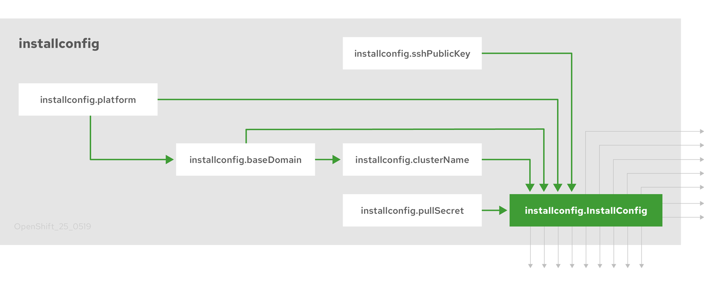

# Installation

Source:

- https://docs.okd.io/latest/architecture/architecture-installation.html
- https://www.openshift-anwender.de/wp-content/uploads/2020/02/OpenShift_Installation_Deep_Dive_Robert_Bohne.pdf

- [Installation](#installation)
  - [1. Overview](#1-overview)
  - [2. Deep Dive](#2-deep-dive)
    - [2.1. Fedora CoreOS](#21-fedora-coreos)
    - [2.2. CRI-O](#22-cri-o)
    - [2.3. Skopeo](#23-skopeo)
    - [2.4. Podman](#24-podman)
    - [2.5. Buildah](#25-buildah)
    - [2.6. Ignition](#26-ignition)
  - [3. Installation Experiences](#3-installation-experiences)
    - [3.1. Full stack automated (IPI)](#31-full-stack-automated-ipi)
    - [3.2. Pre-existing Infrastructure (UPI)](#32-pre-existing-infrastructure-upi)

## 1. Overview

- There are 2 basic types of OKD clusters:

  - installer-provisioned infrastructure clusters (IPI).
  - user-provisioned infrastructure clusters (UPI).

- Subset of the installation targets and dependencies:

## 2. Deep Dive

### 2.1. Fedora CoreOS

- OpenShift -> RHEL CoreOS.
- Each cluster machine uses [Fedora CoreOS (FCOS)](https://getfedora.org/en/coreos?stream=stable).
- FCOS is the immutable container host version of Fedora and features a Fedora kernl with SELinux enabled by default.
- **There are no RPM's anymore**, all is installed via Operators and Container images.
  - Atomic OS Tree.
  - Machine Config Operator:
    - CRI-O config
    - Kubelet config
    - Authorized registries
    - SSH config

### 2.2. CRI-O

https://github.com/cri-o/cri-o

- A lightweight, OCI-compliant container runtime.
  - Minimal and secure architecture.
  - Optimized for Kubernetes.
  - Runs any OCI-compliant image (including Docker)
  - Implements Kubelet Container runtime interface (CRI)

### 2.3. Skopeo

https://github.com/containers/skopeo

- Build for interfacing with Docker registry
- CLI for images and image registries
- Allow remote inspectation of image meta-data - no downloading
- Can copy (non-root) from one storage to another

### 2.4. Podman

https://github.com/containers/podman

- A tool for managing OCI containers and pods
- Support for a Docker-compatible CLI interface.
- Shares state with CRI-O and with Buildah
- No daemon
- Runtime - `runc`
- Full management of images, container lifecycle.
- Support for pods, groups of containers that share resources and are managed together.
- Resource isolation of containers and pods.

### 2.5. Buildah

https://github.com/containers/buildah

- Build OCI compliant images
- No daemon - no "docker socket"
- Can use the host's user's secrets
- **Single layer, from scratch image** are made easy and it ensures limited manifest

### 2.6. Ignition

https://github.com/coreos/ignition

- First boot installer and configuration tool
- Machine generated; machine validate
- Ignition applies a declarative node configuration early in the boot process. Unifies kickstart and cloud-init:
  - Generated via okd install & MCO
  - Configure storage, systemd units, users & remote configs
  - Executed in the initramfs
- How it works?
  - Boot into "early userspace"
  - Change disks, files based on JSON
  - Start the machine

## 3. Installation Experiences

### 3.1. Full stack automated (IPI)

- Simplified opinionated "Best Practices" for cluster provisioning
- Fully automated installation and updates including host container OS

### 3.2. Pre-existing Infrastructure (UPI)

- Customer managed resources and infrastructure provisioning
- Plug into existing DNS and security boundaries
- Note: what mean **Bare metal**?
  - Installation on physical hardware.
  - Installation on virtual machine WITHOUT any guest tool/cloud integration.

